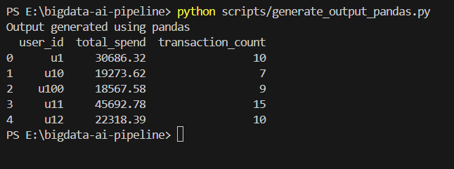

1️⃣ Phase 1: Data Ingestion & Cleaning (Batch)
🎯 Objective :

Ingest raw transaction data and perform basic data cleaning to ensure data quality.

📥 Input :

transactions.json

Each record represents a transaction event with:

user_id
amount
event_time
device
location

⚙️ Processing Steps

Using PySpark:

Read JSON data into a Spark DataFrame
Cast amount field to numeric type

Filter out:

Null values
Invalid or negative transaction amounts

✅ Outcome

A clean, structured DataFrame ready for aggregation and analytics.

2️⃣ Phase 2: Batch Aggregation & Output Generation
🎯 Objective :

Generate user-level spend analytics from transaction data.

🔄 Aggregations Performed

For each user_id:

Total Spend → sum(amount)
Transaction Count → count(*)

This mirrors real-world use cases such as:

Customer analytics
Financial reporting
Behavioral analysis

⚠️ Engineering Challenge (Windows Environment):

While implementing the Spark output step, a known issue was encountered:

"java.lang.UnsatisfiedLinkError: NativeIO$Windows"

This error occurs due to Hadoop Native IO limitations on Windows local filesystems, especially when writing Parquet files using Spark.

🧠 Design Decision & Solution :

The Spark aggregation logic is fully implemented and preserved (spark_batch_job.py)
For local development on Windows, output generation is handled using a Pandas-based fallback (generate_output_pandas.py)
This ensures:
Successful pipeline execution
Verifiable output data
No compromise on Spark logic or design

Note:
The Spark → Parquet output step is intended to run in Linux / WSL / production environments, where Hadoop native libraries are fully supported.

📤 Output (Current Phase)

Generated file: user_spend.csv

Contains:
user_id
total_spend
transaction_count

